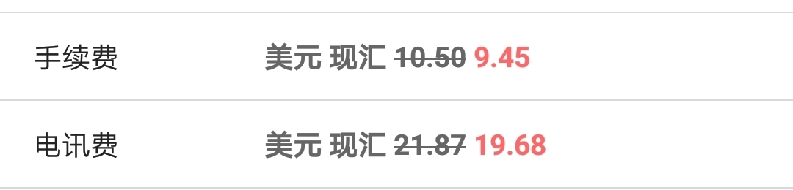
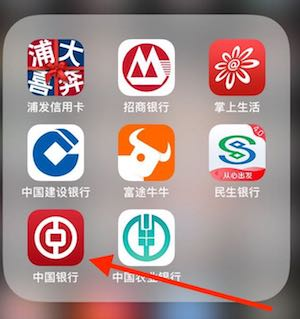
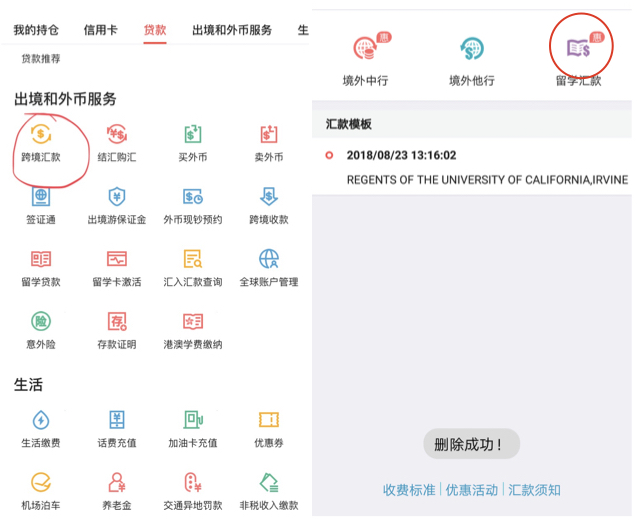
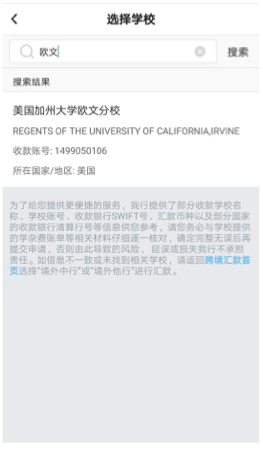
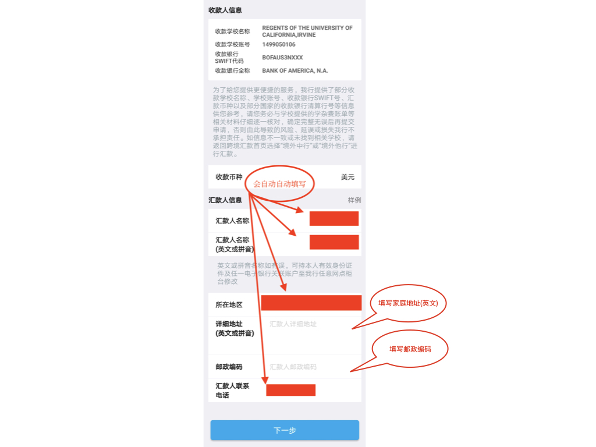
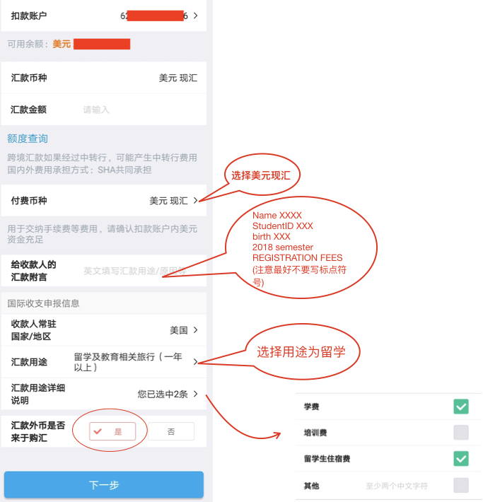

# 用中行手机银行自助交 UCI 学费(亲测有效)

使用手机银行自助电汇方便快捷，并且有手续费优惠: 大概约 ￥180。并且 1-2 个工作日就可以在 https://zotaccount 查到结果。

> (9.45 + 19.68) * 6.9 = 200

### 1 下载中国银行手机 APP

### 2 进入 APP 选择留学汇款

### 3 搜索需要交费的学校

#### 4 填写相关信息(注意最好不要写标点符号)

#### 5 填写汇款信息

在给收款人的汇款附言中填上你的,姓名，studentID(登陆https://zotaccount 时的八位数字 studentID)，生日，付款项(例如 2018 秋季学期学费)

>Name XXXX.  StudentID XXXXXXX.Birth 01012000. 2018 semester REGISTRATION FEES

注: 如果在此处需要填写收款人地址,可以填写学校地址

> University of California, Irvine Irvine, CA 92697  U.S